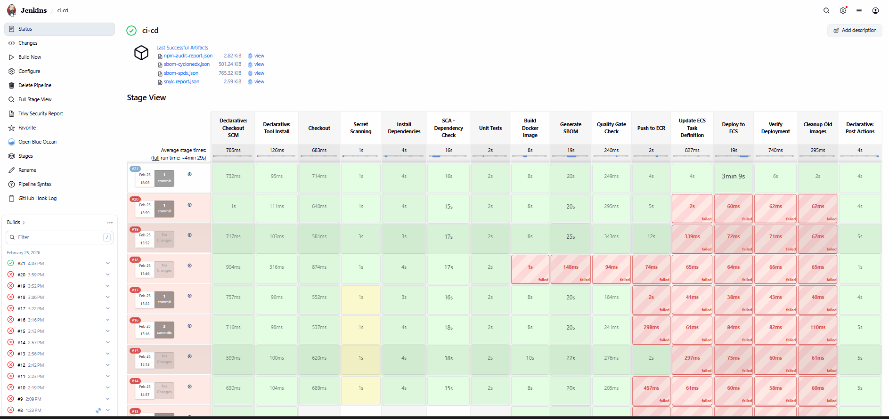

# Infrastructure Documentation

## Overview

This document provides detailed information about the Terraform infrastructure, including all modules, resources, and configurations.

---

## Terraform Structure

### Root Module (`terraform/main.tf`)

The root module orchestrates all infrastructure components:

```hcl
terraform {
  required_version = ">= 1.0"
  required_providers {
    aws = {
      source  = "hashicorp/aws"
      version = "~> 5.0"
    }
  }
}
```

### Provider Configuration

```hcl
provider "aws" {
  region = var.aws_region

  default_tags {
    tags = {
      Project     = var.project_name
      Environment = var.environment
      ManagedBy   = "terraform"
    }
  }
}
```

All resources automatically receive these tags for cost tracking and resource management.

---

## Module Descriptions

### 1. VPC Module (`terraform/modules/vpc/`)

**Purpose**: Creates isolated network infrastructure

**Resources Created**:
- VPC with custom CIDR block (default: 10.0.0.0/16)
- Internet Gateway for public internet access
- 2 Public Subnets across availability zones
- 2 Private Subnets across availability zones
- Route tables for public and private subnets
- Route table associations

**Inputs**:
```hcl
variable "project_name" {
  description = "Name prefix for resources"
  type        = string
}

variable "environment" {
  description = "Environment (dev/staging/prod)"
  type        = string
}

variable "vpc_cidr" {
  description = "CIDR block for VPC"
  type        = string
  default     = "10.0.0.0/16"
}

variable "availability_zones" {
  description = "List of AZs"
  type        = list(string)
}

variable "public_subnets" {
  description = "Public subnet CIDR blocks"
  type        = list(string)
  default     = ["10.0.1.0/24", "10.0.2.0/24"]
}

variable "private_subnets" {
  description = "Private subnet CIDR blocks"
  type        = list(string)
  default     = ["10.0.10.0/24", "10.0.20.0/24"]
}
```

**Outputs**:
```hcl
output "vpc_id" {
  description = "VPC ID"
  value       = aws_vpc.main.id
}

output "public_subnets" {
  description = "List of public subnet IDs"
  value       = aws_subnet.public[*].id
}

output "private_subnets" {
  description = "List of private subnet IDs"
  value       = aws_subnet.private[*].id
}
```

---

### 2. Security Module (`terraform/modules/security/`)

**Purpose**: Manages security groups and firewall rules

**Resources Created**:
- Jenkins Security Group (SSH, HTTP 8080)
- Application Security Group (SSH, HTTP 5000)
- ECS Security Group (HTTP 5000)

**Security Group Rules**:

**Jenkins SG**:
- Ingress: Port 22 (SSH) from allowed_ips
- Ingress: Port 8080 (HTTP) from allowed_ips
- Egress: All traffic to 0.0.0.0/0

**App SG**:
- Ingress: Port 22 (SSH) from Jenkins SG and allowed_ips
- Ingress: Port 5000 (HTTP) from 0.0.0.0/0
- Egress: All traffic to 0.0.0.0/0

**ECS SG**:
- Ingress: Port 5000 (HTTP) from 0.0.0.0/0
- Egress: All traffic to 0.0.0.0/0

**Inputs**:
```hcl
variable "project_name" {
  type = string
}

variable "environment" {
  type = string
}

variable "vpc_id" {
  description = "VPC ID where security groups will be created"
  type        = string
}

variable "allowed_ips" {
  description = "List of CIDR blocks allowed for SSH/Jenkins access"
  type        = list(string)
}
```

**Outputs**:
```hcl
output "jenkins_sg_id" {
  value = aws_security_group.jenkins.id
}

output "app_sg_id" {
  value = aws_security_group.app.id
}

output "ecs_sg_id" {
  value = aws_security_group.ecs.id
}
```

---

### 3. Keypair Module (`terraform/modules/keypair/`)

**Purpose**: Auto-generates SSH key pairs for EC2 access

**Resources Created**:
- TLS private key (RSA 4096-bit)
- AWS key pair
- Local file with private key (.pem)

**Security Features**:
- Private key stored locally with 0400 permissions
- Never committed to version control (.gitignore)
- Unique key per project/environment

**Inputs**:
```hcl
variable "project_name" {
  type = string
}

variable "environment" {
  type = string
}
```

**Outputs**:
```hcl
output "key_name" {
  description = "Name of the SSH key pair"
  value       = aws_key_pair.this.key_name
}

output "private_key_path" {
  description = "Path to private key file"
  value       = local_file.private_key.filename
}
```

**Usage**:
```bash
# SSH to instance
ssh -i terraform/jenkins-cicd-pipeline-dev-keypair.pem ec2-user@INSTANCE_IP
```

---

### 4. Jenkins Module (`terraform/modules/jenkins/`)

**Purpose**: Provisions Jenkins CI/CD server

**Resources Created**:
- EC2 instance (default: t3.medium)
- Elastic IP (optional)
- User data script for automated setup

**Setup Script** (`jenkins-setup.sh`):
1. Updates system packages
2. Installs Docker
3. Creates Docker network for Jenkins
4. Pulls Jenkins LTS image
5. Starts Jenkins container with Docker-in-Docker support
6. Installs Docker CLI and Node.js inside container
7. Configures Jenkins to restart automatically

**Inputs**:
```hcl
variable "project_name" {
  type = string
}

variable "environment" {
  type = string
}

variable "ami_id" {
  description = "Amazon Linux 2 AMI ID"
  type        = string
}

variable "instance_type" {
  description = "EC2 instance type"
  type        = string
  default     = "t3.medium"
}

variable "key_name" {
  description = "SSH key pair name"
  type        = string
}

variable "subnet_id" {
  description = "Subnet ID for Jenkins instance"
  type        = string
}

variable "security_group_ids" {
  description = "List of security group IDs"
  type        = list(string)
}

variable "jenkins_admin_password" {
  description = "Jenkins admin password"
  type        = string
  sensitive   = true
}

variable "aws_region" {
  type = string
}
```

**Outputs**:
```hcl
output "instance_id" {
  value = aws_instance.jenkins.id
}

output "public_ip" {
  value = aws_instance.jenkins.public_ip
}

output "private_ip" {
  value = aws_instance.jenkins.private_ip
}
```

---

### 5. EC2 Module (`terraform/modules/ec2/`)

**Purpose**: Provisions application servers

**Resources Created**:
- EC2 instance (default: t3.small)
- User data script for Docker installation

**Setup Script** (`app-server-setup.sh`):
1. Updates system packages
2. Installs Docker
3. Starts and enables Docker service
4. Adds ec2-user to docker group

**Inputs**:
```hcl
variable "project_name" {
  type = string
}

variable "environment" {
  type = string
}

variable "ami_id" {
  description = "Amazon Linux 2 AMI ID"
  type        = string
}

variable "instance_type" {
  description = "EC2 instance type"
  type        = string
  default     = "t3.small"
}

variable "key_name" {
  description = "SSH key pair name"
  type        = string
}

variable "subnet_id" {
  description = "Subnet ID for app instance"
  type        = string
}

variable "security_group_ids" {
  description = "List of security group IDs"
  type        = list(string)
}

variable "user_data" {
  description = "User data script"
  type        = string
  default     = ""
}
```

**Outputs**:
```hcl
output "instance_id" {
  value = aws_instance.app.id
}

output "public_ip" {
  value = aws_instance.app.public_ip
}

output "private_ip" {
  value = aws_instance.app.private_ip
}
```

---

### 6. ECR Module (`terraform/modules/ecr/`)

**Purpose**: Creates Docker container registry

**Resources Created**:
- ECR repository
- Lifecycle policy for image retention

**Lifecycle Policy**:
- Keeps last 10 tagged images
- Expires untagged images after 7 days
- Automatically cleans up old builds

**Inputs**:
```hcl
variable "project_name" {
  type = string
}

variable "environment" {
  type = string
}
```

**Outputs**:
```hcl
output "repository_url" {
  description = "ECR repository URL"
  value       = aws_ecr_repository.this.repository_url
}

output "repository_arn" {
  description = "ECR repository ARN"
  value       = aws_ecr_repository.this.arn
}

output "repository_name" {
  description = "ECR repository name"
  value       = aws_ecr_repository.this.name
}
```

**Usage**:
```bash
# Login to ECR
aws ecr get-login-password --region eu-central-1 | \
  docker login --username AWS --password-stdin \
  962496666337.dkr.ecr.eu-central-1.amazonaws.com

# Push image
docker tag myapp:latest 962496666337.dkr.ecr.eu-central-1.amazonaws.com/jenkins-cicd-pipeline-app:latest
docker push 962496666337.dkr.ecr.eu-central-1.amazonaws.com/jenkins-cicd-pipeline-app:latest
```

---

### 7. ECS Module (`terraform/modules/ecs/`)

**Purpose**: Sets up container orchestration

**Resources Created**:
- ECS Cluster
- ECS Task Definition
- ECS Service
- Application Load Balancer (optional)
- Target Group
- CloudWatch Log Group

**Task Definition**:
- Launch Type: Fargate
- CPU: 256 (.25 vCPU)
- Memory: 512 MB
- Container Port: 5000
- Health Check: `/health` endpoint

**Service Configuration**:
- Desired Count: 1
- Deployment Type: Rolling update
- Health Check Grace Period: 60 seconds
- Auto-scaling: Optional

**Inputs**:
```hcl
variable "project_name" {
  type = string
}

variable "environment" {
  type = string
}

variable "vpc_id" {
  description = "VPC ID"
  type        = string
}

variable "public_subnets" {
  description = "List of public subnet IDs"
  type        = list(string)
}

variable "ecr_repository_url" {
  description = "ECR repository URL"
  type        = string
}

variable "aws_region" {
  type = string
}
```

**Outputs**:
```hcl
output "cluster_id" {
  value = aws_ecs_cluster.this.id
}

output "cluster_name" {
  value = aws_ecs_cluster.this.name
}

output "service_name" {
  value = aws_ecs_service.this.name
}

output "task_definition_arn" {
  value = aws_ecs_task_definition.this.arn
}
```

---

## Variables Reference

### Root Module Variables (`terraform/variables.tf`)

```hcl
variable "aws_region" {
  description = "AWS region"
  type        = string
  default     = "us-east-1"
}

variable "project_name" {
  description = "Name of the project"
  type        = string
  default     = "cicd-pipeline"
}

variable "environment" {
  description = "Environment name"
  type        = string
  default     = "dev"
}

variable "vpc_cidr" {
  description = "CIDR block for VPC"
  type        = string
  default     = "10.0.0.0/16"
}

variable "public_subnets" {
  description = "Public subnet CIDR blocks"
  type        = list(string)
  default     = ["10.0.1.0/24", "10.0.2.0/24"]
}

variable "private_subnets" {
  description = "Private subnet CIDR blocks"
  type        = list(string)
  default     = ["10.0.10.0/24", "10.0.20.0/24"]
}

variable "allowed_ips" {
  description = "List of allowed CIDR blocks for SSH, Jenkins, and application access"
  type        = list(string)
  
  validation {
    condition     = !contains(var.allowed_ips, "0.0.0.0/0")
    error_message = "allowed_ips must not contain 0.0.0.0/0. Specify trusted CIDR blocks."
  }
}

variable "jenkins_instance_type" {
  description = "Instance type for Jenkins server"
  type        = string
  default     = "t3.micro"
}

variable "app_instance_type" {
  description = "Instance type for application server"
  type        = string
  default     = "t3.micro"
}

variable "jenkins_admin_password" {
  description = "Jenkins admin password"
  type        = string
  sensitive   = true
}
```

---

## Outputs Reference

### Root Module Outputs (`terraform/outputs.tf`)

```hcl
output "vpc_id" {
  description = "VPC ID"
  value       = module.vpc.vpc_id
}

output "jenkins_public_ip" {
  description = "Jenkins server public IP"
  value       = module.jenkins.public_ip
}

output "jenkins_url" {
  description = "Jenkins URL"
  value       = "http://${module.jenkins.public_ip}:8080"
}

output "app_server_public_ip" {
  description = "Application server public IP"
  value       = module.app_server.public_ip
}

output "app_url" {
  description = "Application URL"
  value       = "http://${module.app_server.public_ip}:5000"
}

output "ecr_repository_url" {
  description = "ECR repository URL"
  value       = module.ecr.repository_url
}

output "ecs_cluster_name" {
  description = "ECS cluster name"
  value       = module.ecs.cluster_name
}

output "key_name" {
  description = "SSH key pair name"
  value       = module.keypair.key_name
}

output "ssh_jenkins" {
  description = "SSH command for Jenkins server"
  value       = "ssh -i ${module.keypair.key_name}.pem ec2-user@${module.jenkins.public_ip}"
}

output "ssh_app_server" {
  description = "SSH command for app server"
  value       = "ssh -i ${module.keypair.key_name}.pem ec2-user@${module.app_server.public_ip}"
}
```

---

## Terraform Commands

### Initialize
```bash
cd terraform
terraform init
```

### Validate
```bash
terraform validate
```

### Plan
```bash
terraform plan
```

### Apply
```bash
terraform apply
# or auto-approve
terraform apply -auto-approve
```

### Destroy
```bash
terraform destroy
```

### Show State
```bash
terraform state list
terraform state show module.vpc.aws_vpc.main
```

### Output Values
```bash
terraform output
terraform output -raw jenkins_public_ip
terraform output -json > outputs.json
```

### Import Existing Resources
```bash
terraform import module.vpc.aws_vpc.main vpc-xxxxx
```

### Refresh State
```bash
terraform refresh
```

---

## Best Practices

### 1. State Management
- Store state in S3 with DynamoDB locking (production)
- Never commit `terraform.tfstate` to version control
- Use workspaces for multiple environments

```hcl
terraform {
  backend "s3" {
    bucket         = "my-terraform-state"
    key            = "cicd-pipeline/terraform.tfstate"
    region         = "eu-central-1"
    dynamodb_table = "terraform-locks"
    encrypt        = true
  }
}
```

### 2. Variable Management
- Use `terraform.tfvars` for environment-specific values
- Never commit sensitive values
- Use AWS Secrets Manager for production secrets

### 3. Module Versioning
- Pin module versions in production
- Use semantic versioning
- Test module updates in dev first

### 4. Resource Tagging
- Use consistent tagging strategy
- Include: Project, Environment, Owner, CostCenter
- Leverage default_tags in provider

### 5. Security
- Restrict `allowed_ips` to specific IPs
- Use private subnets for sensitive resources
- Enable VPC Flow Logs
- Use AWS Systems Manager Session Manager instead of SSH

---

## Troubleshooting

### Common Terraform Errors

#### 1. Circular Dependency
**Error**: `Error: Cycle: module.security_groups`

**Solution**: Use separate `aws_security_group_rule` resources instead of inline rules

#### 2. Resource Already Exists
**Error**: `Error: resource already exists`

**Solution**: Import existing resource or destroy and recreate
```bash
terraform import module.vpc.aws_vpc.main vpc-xxxxx
```

#### 3. Invalid Credentials
**Error**: `Error: error configuring Terraform AWS Provider`

**Solution**: Check AWS credentials
```bash
aws sts get-caller-identity
aws configure list
```

#### 4. State Lock
**Error**: `Error: Error locking state`

**Solution**: Force unlock (use with caution)
```bash
terraform force-unlock LOCK_ID
```

---

## Infrastructure Diagram

```
┌─────────────────────────────────────────────────────────────┐
│                         AWS Account                          │
│                                                              │
│  ┌────────────────────────────────────────────────────────┐ │
│  │                    VPC (10.0.0.0/16)                   │ │
│  │                                                         │ │
│  │  ┌──────────────────────┐  ┌──────────────────────┐   │ │
│  │  │  Public Subnet 1     │  │  Public Subnet 2     │   │ │
│  │  │  (10.0.1.0/24)       │  │  (10.0.2.0/24)       │   │ │
│  │  │                      │  │                      │   │ │
│  │  │  ┌────────────────┐  │  │  ┌────────────────┐  │   │ │
│  │  │  │ Jenkins EC2    │  │  │  │ App EC2        │  │   │ │
│  │  │  │ t3.medium      │  │  │  │ t3.small       │  │   │ │
│  │  │  │ Port: 8080     │  │  │  │ Port: 5000     │  │   │ │
│  │  │  └────────────────┘  │  │  └────────────────┘  │   │ │
│  │  └──────────────────────┘  └──────────────────────┘   │ │
│  │                                                         │ │
│  │  ┌──────────────────────┐  ┌──────────────────────┐   │ │
│  │  │  Private Subnet 1    │  │  Private Subnet 2    │   │ │
│  │  │  (10.0.10.0/24)      │  │  (10.0.20.0/24)      │   │ │
│  │  │                      │  │                      │   │ │
│  │  │  ┌────────────────┐  │  │  ┌────────────────┐  │   │ │
│  │  │  │ ECS Task       │  │  │  │ ECS Task       │  │   │ │
│  │  │  │ (Fargate)      │  │  │  │ (Fargate)      │  │   │ │
│  │  │  └────────────────┘  │  │  └────────────────┘  │   │ │
│  │  └──────────────────────┘  └──────────────────────┘   │ │
│  │                                                         │ │
│  │  ┌────────────────────────────────────────────────┐   │ │
│  │  │          Internet Gateway                       │   │ │
│  │  └────────────────────────────────────────────────┘   │ │
│  └─────────────────────────────────────────────────────────┘ │
│                                                              │
│  ┌────────────────────────────────────────────────────────┐ │
│  │                    ECR Repository                       │ │
│  │              jenkins-cicd-pipeline-app                  │ │
│  └────────────────────────────────────────────────────────┘ │
│                                                              │
│  ┌────────────────────────────────────────────────────────┐ │
│  │                     ECS Cluster                         │ │
│  │            jenkins-cicd-pipeline-cluster                │ │
│  └────────────────────────────────────────────────────────┘ │
└─────────────────────────────────────────────────────────────┘
```

---

## GitOps Pipeline

### Overview

The GitOps pipeline automates the entire CI/CD workflow from code commit to production deployment. The pipeline integrates Jenkins, Docker, ECR, and ECS to provide a complete DevOps solution.

### Pipeline Architecture



### Pipeline Stages

#### 1. **Source Control Integration**
- GitHub webhook triggers Jenkins on code push
- Automatic branch detection and checkout
- Git credentials managed securely

#### 2. **Build & Test**
- Node.js application build
- Unit test execution with Jest
- Code quality checks
- Security scanning with Trivy

#### 3. **Docker Image Creation**
- Multi-stage Dockerfile build
- Image optimization and security hardening
- Vulnerability scanning

#### 4. **Container Registry**
- Push to AWS ECR
- Image tagging with build number
- Lifecycle policy management

#### 5. **Deployment Options**

**EC2 Deployment**:
- Direct deployment to EC2 instances
- Blue-green deployment support
- Health checks and rollback

**ECS Deployment**:
- Fargate container orchestration
- Service discovery and load balancing
- Auto-scaling capabilities

### Pipeline Configuration

#### Jenkinsfile Structure
```groovy
pipeline {
    agent any
    
    environment {
        ECR_REGISTRY = "${AWS_ACCOUNT_ID}.dkr.ecr.${AWS_REGION}.amazonaws.com"
        ECR_REPOSITORY = "${PROJECT_NAME}-app"
        IMAGE_TAG = "${BUILD_NUMBER}"
    }
    
    stages {
        stage('Checkout') {
            steps {
                checkout scm
            }
        }
        
        stage('Test') {
            steps {
                sh 'npm install'
                sh 'npm test'
            }
        }
        
        stage('Build Docker Image') {
            steps {
                script {
                    docker.build("${ECR_REPOSITORY}:${IMAGE_TAG}")
                }
            }
        }
        
        stage('Push to ECR') {
            steps {
                script {
                    docker.withRegistry("https://${ECR_REGISTRY}", "ecr:${AWS_REGION}:aws-credentials") {
                        docker.image("${ECR_REPOSITORY}:${IMAGE_TAG}").push()
                        docker.image("${ECR_REPOSITORY}:${IMAGE_TAG}").push("latest")
                    }
                }
            }
        }
        
        stage('Deploy to ECS') {
            steps {
                sh './deploy-ecs.sh'
            }
        }
    }
}
```

### Success Metrics

- **Build Time**: < 5 minutes average
- **Deployment Time**: < 2 minutes
- **Success Rate**: > 95%
- **Rollback Time**: < 1 minute

### Monitoring & Alerts

- CloudWatch integration for logs and metrics
- Jenkins build notifications
- Slack/email alerts on failures
- Application health monitoring

### Security Features

- Container image vulnerability scanning
- Secrets management with AWS Secrets Manager
- Network isolation with VPC
- IAM role-based access control

---

**Last Updated**: 2024
**Terraform Version**: >= 1.0
**AWS Provider Version**: ~> 5.0
